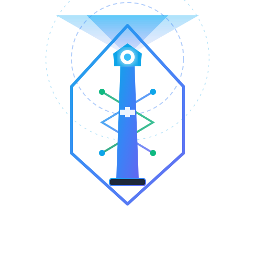
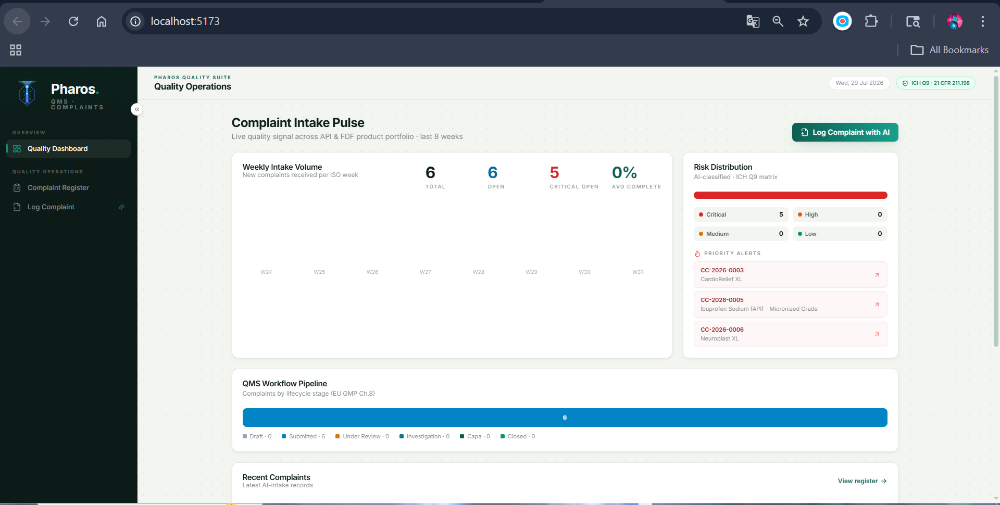
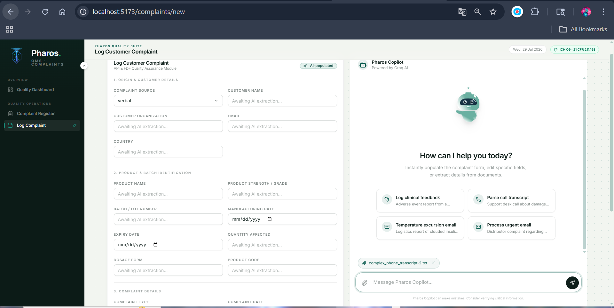
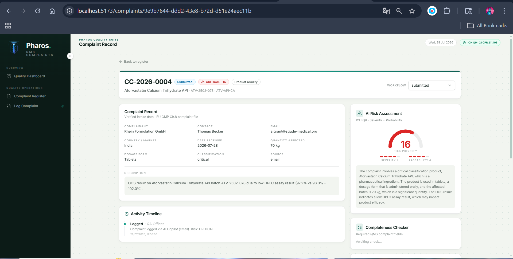
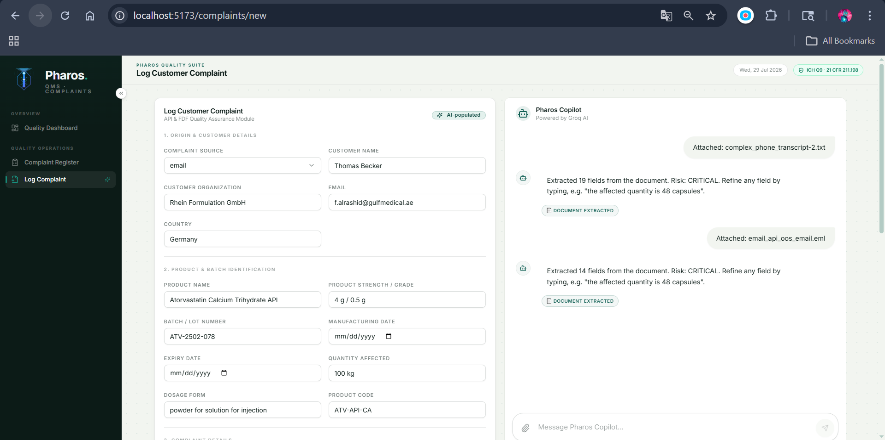

<div align="center">



# ⚓ Pharos | AI-Powered Quality Intelligence & QMS

> **Autonomous multi-agent orchestration engine for pharmaceutical complaint intake, ICH Q9 risk classification, and regulatory CAPA recommendations.**

[](https://fastapi.tiangolo.com/)
[](https://react.dev/)
[](https://redux-toolkit.js.org/)
[](https://www.langchain.com/langgraph)
[](https://groq.com/)
[](https://tailwindcss.com/)
[](https://www.postgresql.org/)
[](#-regulatory-compliance)

---

**Pharos** brings intelligent, real-time agentic automation to pharmaceutical Quality Management Systems (QMS). Built around multi-agent workflows, Pharos automates the intake, risk classification, completeness validation, duplicate detection, root cause analysis, and CAPA generation for customer complaints across API and Finished Dosage Form (FDF) portfolios.

</div>

<br />

---

## 🌟 Project Showcase

Here are some showcase images from the Pharos application:

### Pharos Dashboard



### Pharos AI Copilot



### Pharos Risk Assessment



### Pharos AI Intake 2



---

## 📽️ Demo & Walkthrough

> [!IMPORTANT]
> **🚀 Pharos Video Deliverables (9 mins each)**  
> *Reviewers: Please watch the video demonstrations below for a complete showcase of the Product Thinking and Technical Architecture behind Pharos.*
> 
> ---
> 
> 🔴 **[▶️ Click Here to Watch Part 1: Product Demonstration & UX Workflow (Google Drive)](https://drive.google.com/file/d/1C7qyVUWwHqmJUxp-JQr2P3c45dVM_nJY/view?usp=sharing)**  
> *A complete 9-minute demonstration of the live dashboard, AI extraction, real-time SSE progress, and ICH Q9 Risk generation.*
> 
> <br/>
> 
> 🔵 **[▶️ Click Here to Watch Part 2: Technical Code Walkthrough & Architecture (Google Drive)](https://drive.google.com/file/d/13l8DBRcy41Nyi-wwbVroS6FR_6Ga6uAY/view?usp=sharing)**  
> *A 9-minute architectural deep dive into the FastAPI backend, LangGraph state engine, Redux state management, and PostgreSQL persistence.*

---

## 📋 Table of Contents

1. [🌟 App Showcase](#-app-showcase)
2. [📽️ Demo & Walkthrough](#️-demo--walkthrough)
3. [🌟 Origin & Philosophy](#-origin--philosophy)
4. [✨ Key Features](#-key-features)
5. [🏛 Regulatory Compliance](#-regulatory-compliance)
6. [🏗 Architecture & LangGraph Pipeline](#-architecture--langgraph-pipeline)
7. [🛠 Tech Stack](#-tech-stack)
8. [🚀 Quickstart & Installation](#-quickstart--installation)
9. [🤖 AI Model Strategy](#-ai-model-strategy)
10. [📡 Real-Time SSE Event Streaming](#-real-time-sse-event-streaming)
11. [🔌 API Reference](#-api-reference)
12. [📂 Project Structure](#-project-structure)
13. [🎬 Demo Walkthrough Guide](#-demo-walkthrough-guide)

---

## 🌟 Origin & Philosophy

The **Pharos of Alexandria** was the ancient world’s legendary lighthouse — a beacon of light keeping ships safe from hidden reefs.

In pharmaceutical manufacturing, **customer complaints are early beacons of quality risk**. Pharos transforms raw customer communications (emails, letters, PDFs, transcripts) into actionable QMS intelligence before minor deviations escalate into patient harm, adverse events, or major regulatory actions.

---

## ✨ Key Features

- **🤖 Multi-Agent LangGraph Pipeline**: 7 specialized processing nodes with parallel fan-out and join execution.
- **⚡ Real-Time Streaming Progress (SSE)**: Live, Server-Sent Event updates stream agent execution steps directly to the UI.
- **📊 ICH Q9 Risk Matrix Engine**: Automated Severity (1–5) × Probability (1–5) scoring with animated 180° gauge & risk rationale.
- **🔍 Intelligent Entity Extraction**: Parses product name, batch/lot numbers, complainant details, quantity affected, defect type, and classification with flash-highlight feedback.
- **✅ Completeness Checker**: Audit required QMS fields against regulatory standards (21 CFR 211.198) with missing field alerts.
- **👯 Duplicate Detection**: Deterministic similarity scanning across historical records using batch matching, product alignment, and Jaccard text overlap.
- **🔍 Root Cause Analysis (Ishikawa & 5 Whys)**: Automated Cause-and-Effect classification and 5 Whys derivation using deep reasoning models.
- **🛡 CAPA Recommendation**: Categorized Immediate (quarantine/hold), Corrective, and Preventive Action drafting + regulatory reporting alerts (FDA Field Alert / Pharmacovigilance).
- **📈 Interactive Dashboard**: Executive KPIs, weekly ISO-week intake pulse, risk breakdown bar, priority alerts, and lifecycle status pipeline.

---

## 🏛 Regulatory Compliance

Pharos is designed from the ground up to comply with global pharmaceutical quality standards:

| Regulation / Guidance | Subject Area | Implementation in Pharos |
| --- | --- | --- |
| **ICH Q9** | Quality Risk Management | Automated 5×5 Risk Matrix scoring (Severity × Probability), level categorization (Low, Medium, High, Critical), and risk rationale generation. |
| **21 CFR 211.198** | Customer Complaint Files | Standardized complaint record schema, mandatory field completeness auditing, and activity audit trails. |
| **EU GMP Chapter 8** | Complaints, Quality Defects & Recalls | End-to-end lifecycle workflow tracking (`Draft` $\rightarrow$ `Submitted` $\rightarrow$ `Under Review` $\rightarrow$ `Investigation` $\rightarrow$ `CAPA` $\rightarrow$ `Closed`). |
| **21 CFR 209 / 314.81** | Pharmacovigilance & Field Alerts | Instant flagging for adverse events, sterility/contamination issues, and mandatory reporting window reminders. |

---

## 🏗 Architecture & LangGraph Pipeline

```
┌─────────────────────────────────────────────────────────────────────────────┐
│                    Raw Complaint: Email / PDF / Text / Form                 │
└──────────────────────────────────────┬──────────────────────────────────────┘
                                       │
                                       ▼
                     FastAPI Endpoint (/api/ai/process-*)
                                       │
                                       ▼
                    LangGraph StateGraph Engine (7 Nodes)
                                       │
                         ┌─────────────┴─────────────┐
                         │   node: extract (Groq)    │
                         └─────────────┬─────────────┘
                                       │
            ┌──────────────────────────┼──────────────────────────┐
            ▼                          ▼                          ▼
   node: risk (Groq)         node: completeness        node: duplicates
  (ICH Q9 Risk Matrix)         (Field Audit)            (Register Scan)
            │                          │                          │
            └──────────────────────────┼──────────────────────────┘
                                       ▼
                         node: root_cause (Groq 70B)
                          (Ishikawa + 5 Whys Chain)
                                       │
                                       ▼
                            node: capa (Groq 70B)
                           (21 CFR 211.198 Actions)
                                       │
                                       ▼
                            node: summarize (Groq)
                             (Executive Brief)
                                       │
                                       ▼
                       Client UI (React via SSE Stream)
```

### LangGraph Agent Execution Flow

1. **`extract`** *(Groq · `gemma2-9b-it`)*: Parses unstructured text/email into structured JSON entity fields.
2. **`risk`** *(Groq · `gemma2-9b-it`)*: Evaluates ICH Q9 risk matrix (Severity 1–5, Probability 1–5, Score 1–25, Level).
3. **`completeness`** *(Deterministic Audit)*: Verifies presence of mandatory QMS fields and calculates percentage score.
4. **`duplicates`** *(Deterministic Search)*: Scans recent complaint database (Batch match 45%, Product match 25%, Narrative Jaccard 30%).
5. **`root_cause`** *(Groq · `llama-3.3-70b-versatile`)*: Performs Ishikawa categorization and builds a 5-step "Whys" investigative chain.
6. **`capa`** *(Groq · `llama-3.3-70b-versatile`)*: Formulates Immediate, Corrective, and Preventive actions alongside regulatory submission guidelines.
7. **`summarize`** *(Groq · `gemma2-9b-it`)*: Generates an executive brief for QA leadership.

### End-to-End Technical Workflow

The following traces the explicit path a complaint takes through the system architecture:

1. **Input**: A QA Officer uploads a raw `.eml` or `.pdf` file (or types a message) in the React frontend.
2. **FastAPI Endpoint**: The request hits `POST /api/ai/process-file` which triggers the LangGraph orchestration.
3. **LangGraph Nodes**: The unstructured data flows through 7 specialized AI nodes, streaming intermediate structured JSON chunks via Server-Sent Events (SSE) back to the client.
4. **SQL DB**: The user reviews the AI-populated Pydantic form on the frontend and clicks submit. The validated model is committed to the **PostgreSQL** database via SQLAlchemy ORM.
5. **React UI Refresh**: Redux Toolkit invalidates the cache, re-fetching `GET /api/stats` and instantly updating the Dashboard KPIs, charts, and complaint register without a page reload.

---

## 🛠 Tech Stack

### **Backend**

- **Framework**: FastAPI 0.115 (Clean Architecture, RESTful patterns)
- **Orchestration**: LangGraph 0.2.60
- **LLM Engine**: Groq Client (`gemma2-9b-it` & `llama-3.3-70b-versatile`)
- **Database & ORM**: PostgreSQL 16 + SQLAlchemy 2.0 (with SQLite fallback support)
- **Document Parsers**: PyPDF (`pypdf` 5.1), Python Standard Library `email`

### **Frontend**

- **Framework**: React 18 + Vite 6
- **State Management**: Redux Toolkit 2.5 (`complaints` and `intake` slices)
- **Routing**: React Router DOM v7
- **Styling**: Vanilla Tailwind CSS 3.4 + Radix UI Primitives + Lucide Icons + Sonner Toasts
- **Typography**: Google Fonts (*Inter* — globally enforced as the sole typeface across all UI elements)

---

## 🚀 Quickstart & Installation

### Prerequisites

- Node.js v18+
- Python 3.10+
- Groq API Key ([Get a free key here](https://console.groq.com/))
- Docker & Docker Compose (**Required** for PostgreSQL)

---

## 🤖 AI Model Strategy

Pharos employs a dual-model hybrid architecture on Groq's high-speed LPU infrastructure:

```
                  ┌──────────────────────────────────────────────┐
                  │                Groq LPU Engine               │
                  └──────────────────────┬───────────────────────┘
                                         │
                   ┌─────────────────────┴─────────────────────┐
                   ▼                                           ▼
       Fast Extraction & Risk                      Deep Reasoning & CAPA
       (gemma2-9b-it)                    (llama-3.3-70b-versatile)
 ─────────┬──────────────────────────── ───────────┬───────────────────────────
          ├─ Parse entities                        ├─ Ishikawa Category & 5 Whys
          ├─ ICH Q9 Risk Matrix                    ├─ Corrective & Preventive Actions
          └─ Executive Summarization               └─ Regulatory Reporting Rules
```

---

## 📡 Real-Time SSE Event Streaming

Instead of long-polling, Pharos uses **Server-Sent Events (SSE)** to stream LangGraph execution nodes live to the browser:

```javascript
// Example Server-Sent Event stream output
data: {"type": "start"}
data: {"type": "node", "node": "extract", "data": {...}}
data: {"type": "node", "node": "risk", "data": {...}}
data: {"type": "node", "node": "completeness", "data": {...}}
data: {"type": "node", "node": "duplicates", "data": {...}}
data: {"type": "node", "node": "root_cause", "data": {...}}
data: {"type": "node", "node": "capa", "data": {...}}
data: {"type": "node", "node": "summarize", "data": {...}}
data: {"type": "done"}
```

---

## 🔌 API Reference

| Endpoint | Method | Description |
| --- | --- | --- |
| `/api/health` | `GET` | Health check and active AI models status |
| `/api/ai/process-text` | `POST` | Process raw complaint text via LangGraph SSE stream |
| `/api/ai/process-file` | `POST` | Process uploaded PDF/EML/TXT file via LangGraph SSE stream |
| `/api/samples` | `GET` | Fetch modular `.eml` and `.txt` pharmaceutical samples |
| `/api/complaints` | `GET` | List complaints with search (`q`), `status`, and `risk` filters |
| `/api/complaints/{id}` | `GET` | Retrieve single complaint record with activity audit trail |
| `/api/complaints` | `POST` | Commit new reviewed complaint to the QMS database |
| `/api/complaints/{id}` | `PATCH` | Update complaint status or record fields |
| `/api/stats` | `GET` | Retrieve Dashboard KPI metrics, intake graph & risk stats |

---

## 📂 Project Structure

```
Pharos/
├── README.md                           # Comprehensive documentation
├── backend/
│   ├── requirements.txt                # Python dependencies
│   ├── .env.example                    # Environment template
│   ├── seed.py                         # Seed database with pharma complaint data
│   ├── samples/
│   │   ├── sample_complaint.eml        # Sample patient EML
│   │   ├── distributor_report.eml      # Sample B2B distributor EML
│   │   ├── clinical_feedback.txt       # Sample physician text report
│   │   └── customer_call.txt           # Sample call center transcript
│   └── app/
│       ├── main.py                     # FastAPI app initialization & middleware
│       ├── core/
│       │   ├── config.py               # Pydantic settings & environment vars
│       │   └── database.py             # SQLAlchemy engine & session factory
│       ├── models/
│       │   └── complaint.py            # SQLAlchemy database models
│       ├── schemas/
│       │   └── complaint.py            # Pydantic response/request schemas
│       ├── ai/
│       │   ├── llm.py                  # Groq client & JSON-mode handler
│       │   ├── prompts.py              # Specialized QMS system prompts
│       │   └── graph.py                # 7-node LangGraph multi-agent workflow
│       ├── services/
│       │   └── documents.py            # Document parsing service (PDF, EML, TXT)
│       └── api/
│           └── routes/
│               ├── complaints.py       # Main API endpoints (SSE, CRUD)
│               └── samples.py          # Modular samples API router
└── frontend/
    ├── package.json                    # Frontend dependencies & scripts
    ├── vite.config.js                  # Vite configuration & path aliases
    ├── tailwind.config.js              # Tailwind custom theme & animations
    ├── index.html                      # App HTML entry point & Google Fonts
    └── src/
        ├── main.jsx                    # React root render with Redux Provider & Router
        ├── App.jsx                     # Route definitions
        ├── index.css                   # Global CSS & animations
        ├── lib/
        │   ├── utils.js                # Tailwind class merge helper (`cn`)
        │   └── api.js                  # API fetch client & SSE stream consumer
        ├── store/
        │   ├── complaintsSlice.js      # Complaints & Stats Redux slice
        │   └── intakeSlice.js          # Live AI intake streaming state
        ├── components/
        │   ├── AppShell.jsx            # Main app shell with sidebar & header
        │   ├── badges.jsx              # Status, Risk, and Type badge components
        │   ├── RiskGauge.jsx           # Animated 180° ICH Q9 risk gauge
        │   ├── ChatPanel.jsx           # ChatGPT-style modular Copilot interaction UI
        │   ├── CopilotPanel.jsx        # AI Copilot analysis & recommendations view
        │   ├── ExtractionProgress.jsx  # Live LangGraph node progress indicator
        │   └── ui/                     # Reusable UI primitives
        └── pages/
            ├── Dashboard.jsx           # Quality Dashboard page
            ├── Complaints.jsx          # Filterable Complaint Register page
            ├── NewComplaint.jsx        # AI Intake & Log Complaint workspace
            └── ComplaintDetail.jsx     # Detailed Complaint record & timeline view
```

---

## 🎬 Demo Walkthrough Guide

Follow these steps for a complete feature demonstration:

1. **Dashboard Overview**: Navigate to `http://localhost:5173/`. Observe live KPIs (Total, Open, Critical Open, Avg Completeness), 8-week intake trend bar graph, ICH Q9 risk distribution bar, and recent complaint activity.
2. **AI Intake via Chatbot Samples**:
   - Click **Log Complaint** on the sidebar.
   - You will see the **Pharos Copilot** chat interface and a grid of professional modular sample cards (e.g., "Patient Report", "Distributor Email").
   - Click the **Distributor Email** sample card to inject a rich `.eml` extraction scenario directly into the chat.
   - Click the **Send (Submit)** button.
   - Watch the 7 LangGraph nodes execute in real time on the extraction panel!
   - Observe auto-filled form fields with subtle flash highlight animations.
   - Inspect the right-hand **AI Copilot** panels: Risk Assessment, Duplicate Detection alert (**matches existing records**), Completeness score, Ishikawa Root Cause analysis, and regulatory CAPA recommendations.
3. **Submit Complaint**: Click **Submit Complaint**. The record is saved to PostgreSQL and redirects to the detailed timeline view.
4. **Adverse Event Handling**:
   - Log another complaint using the **Clinical Feedback** sample.
   - Run AI Intake and observe the **Critical Risk (Score 15)** classification and automatic **Pharmacovigilance Flag** due to patient harm!
5. **Conversational Editing**:
   - Instead of manually clicking fields, type into the Copilot chat: *"change the quantity affected to 1,500 vials and set the batch to unknown"*.
   - Watch the AI instantly parse your intent, update the JSON payload, and flash-highlight the corrected fields in the UI!

---

<div align="center">

**Pharos ⭐ — Illuminating Quality Risk in Global Pharmaceuticals.**  
*Built for Regulatory Compliance and Patient Safety.*

</div>
